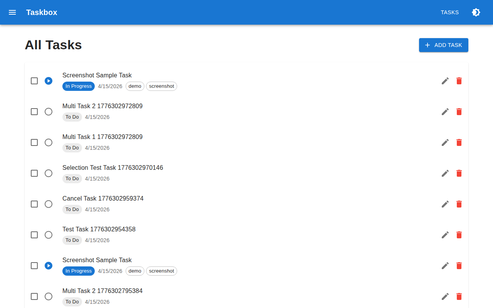
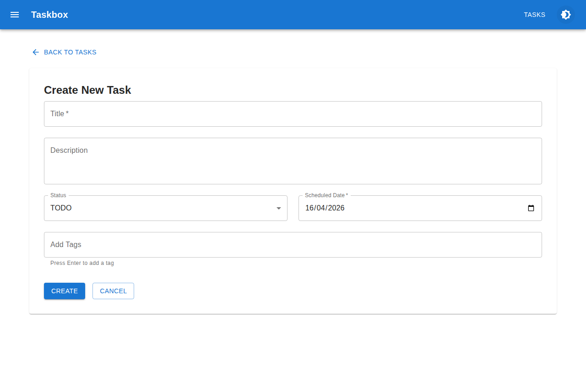
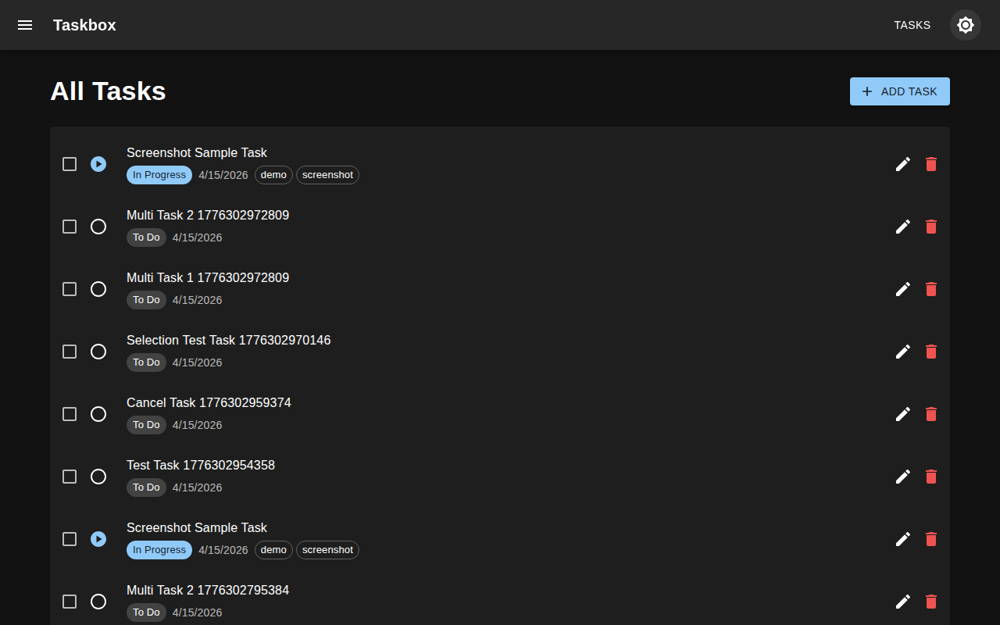

# Taskbox

Taskbox is a task management application built as a monorepo with a RESTful backend API. It provides a lightweight solution for organizing tasks with features like status tracking, tagging, and date scheduling, using modern web technologies designed for simplicity and ease of deployment.

- **Backend API** – Express.js with TypeScript providing complete CRUD operations for task management with Prisma ORM
- **Database** – SQLite with JSON array support for flexible tagging and Prisma migrations for schema versioning
- **Filtering & Search** – Query tasks by status, scheduled date, tags, or search text across title and description
- **Pagination** – Cursor-based pagination with sortable fields (created date, scheduled date, title, status) for efficient data retrieval
- **Validation** – Strict input validation using Zod schemas with detailed error responses and normalized tag handling
- **Monorepo Structure** – Clean separation between backend API and frontend (ready for expansion)

## Prototype Limitations

This project is a demo/prototype and intentionally omits features that would be useful for a production application but add unnecessary complexity for proof-of-concept work:

- **Authentication & Authorization** – No user accounts, login sessions, or role-based access control
- **Localization (i18n)** – UI is English-only with no multi-language support
- **Error Monitoring & Logging** – No external logging services (Sentry, Datadog, etc.) or structured logging
- **Rate Limiting** – No API request throttling or abuse prevention
- **Real-time Updates** – No WebSockets or Server-Sent Events for live data sync
- **File Attachments** – No support for uploading images, documents, or other files to tasks
- **Email Notifications** – No reminder emails, daily digests, or alerts
- **Collaboration Features** – No comments, mentions, task sharing, or activity history
- **Audit Logging** – No tracking of who changed what and when
- **Accessibility (a11y)** – Not tested for screen readers or full WCAG compliance
- **Offline Support** – No service workers or Progressive Web App capabilities
- **Data Import/Export** – No backup, CSV export, or migration tools
- **API Documentation** – No OpenAPI/Swagger specs 
- **Admin Dashboard** – No user management, system metrics
- **CI/CD Pipeline** – No automated testing, building, or deployment workflows

## Screenshots

| Main View (Light) | Create Task | Dark Theme |
|:---:|:---:|:---:|
|  |  |  |

*Screenshots are generated manually. To update them, run `npm run generate-screenshots` in the `frontend/` directory.*

## Deployment

- **Frontend** – Statically exported and can be hosted on any static hosting service (GitHub Pages, Cloudflare Pages, Vercel, Netlify, or similar)
- **Backend** – Can be hosted on any platform that supports running a Node.js process (VPS, PaaS, containerized environments, or serverless functions)
